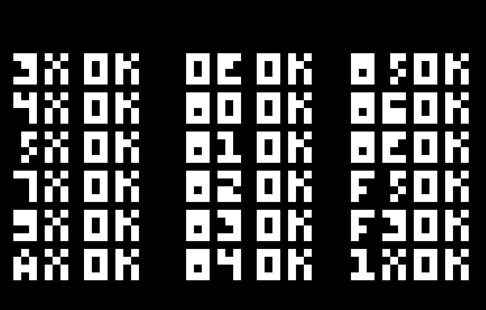

# Chip 8 interpreter in Go

### IBM logotype
The Hello World of CHIP-8 emulation.


### Op codes test


## Abbreviated instructions
Some abbreviated "logs" of instructions emitted by various ROMs. Useful for learning and understanding what/how ROMs try to accomplish.
### IBM logo
```
0e0 - clears screen
a22a - set index register to 0x22A / this should be where the "I" sprite begins
60c - set register 0 to 0xC (decimal 12). This is the top-left corner of the I in IBM, x-wise.
618 - set register 1 to 0x8 (decimal 8). This is also the top-left corner I, but y-wise.
d01f - call the draw function, use value in register 0 as X and value in register 1 as Y. Draw 15 lines. Incidentally, the IBM logo IS 15 lines high...
709 - increment (add) value in register 0 by 0x9 (decimal 9). This "moves" the "cursor" to the top-left x pos of B in IBM.
a239 - set index register to 0x239. This is where the "B" sprite begins.
d01f - draw the left part of the B, again using register 0 as x and register 1 as y, 15 lines.
a248 - since the B is wider than a single sprite, we need to point at the second half of the B sprite
708 - increment (add) value in register 0 by 0x8 (for the right part of the B)
d01f - draw the rest of the B
704 - increment (add) value in register 0 by 0x4 (decimal 4) to move "x" to start of M. M is wide, 19 pixels, so we'll need 3 sprites/draws.
a257
d01f
708
a266
d01f
708
a275
d01f
```

### opcodes test
```
124E - Jump to memory location 0x124 (292 decimal)
6801 - Set register 8 to 1
6905 - Set register 9 to 5
6A0A - Set register A (10) to A (decimal 10)
6B01 - Set register B (11) to 1
652A - Set register 5 to 2A (42)
662B - Set register 6 to 2B (43)
A216 - Set index register to 0x216 (534) (this may be an embedded font?)
D8B4 - Draw at register 8's val register as column and 11's val as row, for 4 lines. 1, 1.
A23E - Set index register to 23E (this should be some kind of font change)
D9B4 - Draw at x:5, y:1, 4 lines.
A202
362B
DAB4
6B06
A21A
D8B4
A23E
D9B4
A206
452A
A202
DAB4
6B0B
A21E
D8B4
A23E
D9B4
A206
5560
A202
DAB4
6B10
A226
D8B4
A23E
D9B4
A206
76FF
462A
A202
DAB4
6B15
A22E
D8B4
A23E
D9B4
A206
9560
A202
DAB4
6B1A
A232
D8B4
A23E
D9B4
2242
A202
DAB4
00EE
6817
691B
6A20
6B01
A20A
D8B4
A236
D9B4
A202
DAB4
6B06
A22A
D8B4
A20A
D9B4
A206
8750
472A
A202
DAB4
6B0B
A22A
D8B4
A20E
D9B4
A206
672A
87B1
472B
A202
DAB4
6B10
A22A
D8B4
A212
D9B4
A206
6678
671F
8762
4718
A202
DAB4
6B15
A22A
D8B4
A216
D9B4
A206
6678
671F
8763
4767
A202
DAB4
6B1A
A22A
D8B4
A21A
D9B4
A206
668C
678C
8764
4718
A202
DAB4
682C
6930
6A34
6B01
A22A
D8B4
A21E
D9B4
A206
668C
6778
8765
47EC
A202
DAB4
6B06
A22A
D8B4
A222
D9B4
A206
66E0
866E
46C0
A202
DAB4
6B0B
A22A
D8B4
A236
D9B4
A206
660F
8666
4607
A202
DAB4
6B10
A23A
D8B4
A21E
D9B4 - Draw ...
A3E8 - Set index register I to 0x3E8
6000 - Store the value 0 in register 0 (this is probably an explicit reset)
6130 - Store the value 0x30 in register 1.
F155 - Store values of register 0 and 1 in memory using index I and I+1.
A3E9 - Set index register I to 0x3E9 (this is one more than last time)
F065 - Load value from memory at I into register 0
A206 - Set index register I to 0x206
4030 - Skip next instruction IF value in register 0 is NOT 0x30.
DAB4 - Draw OK (?)
6B15 - Set register 11 to 0x15.
A23A - Set index register I to 0x23A
D8B4 - Draw at r8/r11, 4 lines
A216
D9B4
A3E8
6689
F633
F265
A202
3001
A206
3103
A206
3207
A206
DAB4
6B1A
A20E
D8B4
A23E
D9B4
1248
A202
DAB4
```

## Pong

Start of running pong...
```
6A02 - Store value 2 in register A
6B0C - Store value 0xC (12) in register B. I.e - left paddle at x:2, y: 12.
6C3F - Store value 0x3F (63) in register C
6D0C - Store value 0x0C (12) in register D. This is location of right paddle.
A2EA - Set I to 0x2EA, should be paddle sprite location in memory.
DAB6 - Draw at val of reg A for x, reg B for y, 6 lines. (Should be left paddle).
DCD6 - Draw at val of reg C for x, reg D for y, 6 lines. (Should be right paddle).
6E00 - Store value 00 in register E
22D4 - Call subroutine by setting PC=0x2D4, stores PC=0xF in stack frame.
A2F2 - Set I to 0x2F2
FE33
F265
F129
6414
6500
D455
7415
F229
D455
00EE
6603
6802
6060
F015
F007 - Set register 0 to value of delay timer.
3000 - Skip next if value in register X is 00
121A - (probably skipped: jump I to 0x21A)
F007 - Set register 0 to value of delay timer.
3000
121A
F007
3000
121A
F007
3000
121A
F007
3000
121A
F007
3000
121A
F007
3000
121A
F007
3000
121A
F007
3000

```

More of Pong, when score does not update properly:
```
E0A1
601F
8D02
DCD6
A2F0
D671
8684
8794
603F
8602
611F
8712
4602
463F
471F
4700
D671
122A
A2EA
DAB6
DCD6
6001
E0A1
6004
E0A1
601F
8B02
DAB6
600C
E0A1
600D
E0A1
601F
8D02
DCD6
A2F0
D671
8684
8794
603F
8602
611F
8712
4602
463F
471F
4700
D671
122A
A2EA
DAB6
DCD6
6001
E0A1
6004
E0A1
601F
8B02
DAB6
600C
E0A1
600D
E0A1
601F
8D02
DCD6
A2F0
D671
8684
8794
603F
8602
611F
8712
4602
463F
471F
4700
D671
122A
A2EA
DAB6
DCD6
6001
E0A1
6004
E0A1
601F
8B02
DAB6
600C
E0A1
600D
E0A1
601F
8D02
DCD6
A2F0
D671
8684
8794
603F
8602
611F
8712
4602
463F
471F
4700
D671
122A
A2EA
DAB6
DCD6
6001
E0A1
6004
E0A1
601F
8B02
DAB6
600C
E0A1
600D
E0A1
601F
8D02
DCD6
A2F0
D671
8684
8794
603F
8602
611F
8712
4602
463F
471F
4700
6901
D671
122A
A2EA
DAB6
DCD6
6001
E0A1
6004
E0A1
601F
8B02
DAB6
600C
E0A1
600D
E0A1
601F
8D02
DCD6
A2F0
D671
8684
8794
603F
8602
611F
8712
4602
463F
471F
4700
D671
122A
A2EA
DAB6
DCD6
6001
E0A1
6004
E0A1
601F
8B02
DAB6
600C
E0A1
600D
E0A1
601F
8D02
DCD6
A2F0
D671
8684
8794
603F
8602
611F
8712
4602
463F
1282
68FE
630A
8070
80D5
3F01
12A2
6020
F018
22D4
A2F2
FE33
F265
F129
6414
6500
D455
7415
F229
D455
00EE
8E34
22D4
A2F2
FE33
F265
F129
6414
6500
D455
7415
F229
D455
00EE
663E
3301
6603
68FE
3301
6802
1216
6060
F015
F007
3000
121A
F007
3000
121A
F007

```